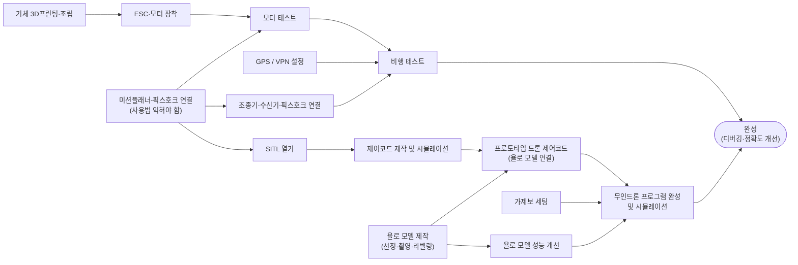

## 작업 과정(Graph)



- 모터 4개 방향 (회전 방향 CW/CCW 배치 확인), 모터 번호 맞추기
- 전원 분배(PDB) 배선, XT60 극성 확인 → **첫 전원 인가 전 반드시 재확인**(클로드가 그럼... 뭔말인지 모르겠어요)
- 젯슨 ↔ 픽스호크 USB 케이블 고정 (진동으로 빠지지 않게 결속)
      ** 아니면, UART / USB-to-TTL 컨버터 방식 활용.
- 전체 무게 측정 (젯슨 + 배터리 포함) → 추력 여유 확인

## signal
```
Jetson Nano (MAVLink) ──> pixhawk ──> esc ──> motor
                            ^
                            │
controller ──> receiver ────┘
```
- Jetson ↔ pixhawk : USB (`/dev/ttyACM0`, 115200)
- controller ↔ receiver : 수동 조종 / 비상 개입 경로. **자동 제어 중에도 항상 살려둘 것**

### 젯슨 사양 (실측)
| 항목 | 값 |
|---|---|
| 보드 | NVIDIA Jetson Nano Developer Kit (Tegra X1) |
| 메모리 | 3.9G (CPU/GPU 공유), zram 1.9G — **디스크 스왑 없음** |
| 저장공간 | 30G SD, 11G 여유 |
| 소프트웨어 | Python 3.6.9 / torch 1.10.0 / numpy 1.13.3 / CUDA 사용 가능 |
| 카메라 | imx219 (CSI, `/dev/video0`) |
| 전원 모드 | MAXN |

### Mission Planner (SITL)
```
connect port
   ├─ Mission Planner  ─ tcpin:5760
   └─ control code     ─ tcpin:5762
```
두 포트 모두 MAVProxy 가 여는 출력이다. 소스(`--master`)는 실물 `/dev/ttyACM0` 이거나
SITL `udpin:0.0.0.0:14550` 중 **하나만** 고른다. (동시에 띄우면 5760/5762 충돌)

## 스크립트 수정

- `control.py` 연결 주소를 `udp:127.0.0.1:14550` → `tcp:127.0.0.1:5762` 로 통일
      (지금은 UDP 포트를 직접 bind 해서 MAVProxy 와 충돌. 자세한 건 README ②번)
- `drone_lib.connect()` 타임아웃 메시지의 `14561` 안내 문구 수정
- `control.py` 의 `takeoff()` → `land()` 사이에 **고도 도달 확인 루프** 추가
    (현재는 대기 없이 착륙 명령이 나감)
- `arm_disarm()` 에 `COMMAND_ACK` 확인 추가 — `test_arm.py` 의 검증 로직을
    `drone_lib` 로 끌어올려 재사용
- 연결 주소·고도 하드코딩 값을 `argparse` 로 (`check_link.py` 방식으로 통일)

## 저장소 정리

- [ ] (10분) `.gitignore` 추가 : `__pycache__/`, `*.tlog`, `*.tlog.raw`, `*.parm`, `*.swp`, `*.pt`
      (`mav.tlog` 14MB, `mav.tlog.raw` 11MB 는 커밋하지 말 것)
- [ ] (10분) 미커밋 정리 : `check_link.py`, `test_arm.py`, `project_log/` 커밋 / 삭제된 `connect.py` 반영
- [ ] (10분) git remote 설정 (현재 로컬 저장소만 있음)

## About software

(dir)control_drone
      |___control_lib.py      :드론 제어에 필요한 함수 라이브러리
      |___control_test.py     :sitl에서 제어 코드 확인 목적
      |___control.py          :실기체 날릴 때 사용(미완_욜로 끊기면 정지 등의 안전 문제 해결 필요)

camera test - 카메라 사용 시, cpu/ram 리소스 사용량 확인
            - fps, 화질 등 실시간 체크
            - 욜로 모델에서 받을 수 있는 화질 및 fps확인 후, 제한 프로그램
            - 색감 개선
            - 젯슨에서 욜로 모델에 줄 것, 실시간 송출용 브랜치 구분
            - 카메라 실시간 테스트 및 로그 기록 프로그램(rpi5에 있음.)

YOLO_model_prototype
            - cpu, ram, 쿨럭 테스트(with camera)
            - YOLO-control.py 연결

YOLO 모델
      - 어떻게 개선을 하면 좋을 지 방향을 잡을 필요가 있음.(ASTROHOME 컴에서 진행)
      - YOLO 모델 축소(TensorRT)

파이프라인 일원화 : 확정된 파이프라인 문자열이 **지금 3곳에 흩어져 있다.**
      - `~/camera_stream.py`
      - `~/yolo-jetson/benchmark_yolo_camera.py`
      - `~/yolo-jetson/run_yolov5n.sh`

## 디버깅

YOLO 돌린 결과 log로 남겨서 약점 체크 및 보안
Jetson이 기준 쿨럭 초과 및 cpu사용량 일정 한계 넘었을 때, 안전을 위한 조치 필요

### for Hardware


## 야외 비행

- 장소 확보 (개활지, 사람·건물 없는 곳), 비행 가능 구역 확인
- 프로펠러 장착 (CW/CCW 위치 확인) — 장착은 현장 도착 후
- STABILIZE 로 호버 1분, 진동·드리프트 관찰
- ALT_HOLD → LOITER 순으로 확인
- GUIDED 전환 후 `control.py` 로 저고도(2~3m) 자동 이륙/착륙
      → **송신기는 계속 손에, 언제든 STABILIZE 로 뺏을 수 있게**
- **비행 중 카메라 녹화** — D-1 학습 데이터로 그대로 사용
- 로그(`.bin`) 회수 및 진동(VIBE)·전류 확인
- 실패 대응 절차 문서화 (RTL 스위치, 시동 끄기 조건)

## 모터 테스트

**이 단계 전부 프로펠러 없이 진행한다.**

- `python3 check_link.py --address /dev/ttyACM0` — heartbeat / 배터리 전압 / GPS fix 확인
- 가속도계 · 나침반 · 라디오 · ESC 캘리브레이션 (Mission Planner)
- 송신기 스틱 방향 · 모드 스위치(STABILIZE / GUIDED / RTL / LAND) 매핑 확인
- 페일세이프 설정 — 송신기 신호 끊김, 배터리 저전압
- `python3 test_arm.py --address /dev/ttyACM0` — ARM/DISARM 및 PreArm 메시지 확인
- PreArm 경고 전부 해소 (EKF, GPS, 나침반)
      → 캘리브레이션만으로 끝나면 1시간, 센서/배선 문제면 하루 이상
- 모터 테스트(Mission Planner Motor Test)로 회전 방향·순서 확인
- 파라미터 백업 : `pixhawk_PH4-mini_YYYY-MM-DD.parm` 로 저장
